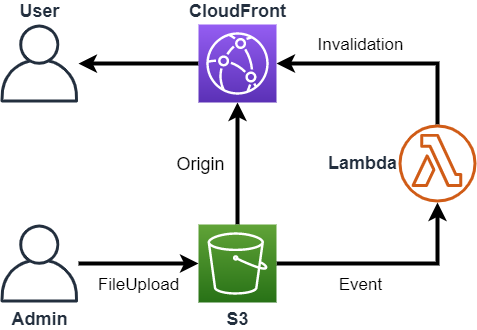

# aws-s3-cloudfront-invalidation
S3를 컨텐츠 저장소로 사용하고 이를 cloudfront와 연동하여 서비스를 제공할수 있다.\
그러나 기본적으로 CloudFront는 24시간 동안 Amazon S3에서 응답을 캐시하게 됩니다. 즉, 24시간 이내에 Amazon S3 응답을 제공하는 엣지 로케이션에 요청이 도달하면 Amazon S3에서 콘텐츠를 업데이트했어도 CloudFront는 캐시된 응답만을 사용하게 됩니다.\
이럴 경우 다음과 같은 방법을 통해서 해결하게 됩니다.
* S3 객체를 무효화
* 객체 버전 관리

여기서는 cloudfront에서 S3 객체를 무효화 하는 방법으로 해결하는 것으로 이야기 합니다.

--- 

## 구성도
기본 구성에서는 CloudFront에서는 Orgin으로 S3를 지정하고 컨텐츠를 제공한다.\
이 문서에서는 Lambda를 추가로 구성하여, 업로드된 파일에 대해서 무효화를 자동으로 수행하여 제공하는 컨텐츠에 대한 이슈를 해결한다.



1. 관리자가 S3로 변경된 객체를 업로드
2. S3 버킷내 `PUT`이 발생된 객체에 대해서 이벤트 발생하며 Lambda 호출
3. Lambda에서는 이벤트에 대해서, 해당 객체 키에 해당되는 경로를 cloudfront에 무효화 수행

## IAM Policy & Role
IAM 정책에서는 별도 정책을 생성하고, 정책에 필요한 최소한의 권한을 부여하기를 권장한다.\
이는 사용자뿐만 아니라 서비스에 할당되는 역할에도 동일하게 적용이 필요하다.\
이 문서에서는 Lambda를 실행하기 위한 최소한의 권한을 부여한다.

Lambda에서 실행시 참조하게된 IAM 정책은 [s3-cloudfront-policy.json](./src/s3-lambda-cloudfront-policy.json)를 참고하면 된다.

간단하게 정리하면 아래와 같다.

* S3에서 이벤트를 수신하기 위한 GetBucketNotification을 허용하고, 이때 특정 버킷에 대한 리소스를 지정 권장
* CloudFront로는 무효화 리스트를 확인하고 생성하는 정책을 허용하고, S3와 마찬가지고 특정 CloudFront의 ARN을 제한 권장
* 마지막으로는 수행되는 Lambda가 정상적으로 동작하는 로그를 남기기 위한 CloudWatch Logs에 저장이 가능한 정책을 허용

이후 Lambda에서 접근 가능하도록 역할을 생성하고 만든 정책을 부여한다.


## Lambda 
이 문서에서 Lambda는 S3에서 발생된 이벤트에서 어떠한 객체가 변경되었고, 해당 객체의 경로를 가지고 CloudFront로 무효화 요청을 수행한다.

Lambda는 구성 시 다양할 설정이 필요하며, 다음 정보를 참고하여 기본 설정을 진행한다.\
상세한 고급 설정들은 필요에 따라 설정하길 바란다. 


### Basic Settings
* Runtime : Go 1.x
* Memory : 128 MB
* Timeout : 3 sec

### Environment Variables
|Key|Value|comment|
|-|-|-|
|DistributionId|*[distribution id]*|객체 무효화가 수행될 cloudfront distibution id 값|

### 배포 패키지 생성
> **NOTE :**
> Go를 런타임으로 사용하여 lambda 구성을 해보았으며, Go의 경우 아직은 lambda내 편집기가 지원하지 않는 언어로서 별도의 배포 패키지를 zip형식으로 만들어서 업로드해야만 한다.\
자세한 배포 패키지 생성을 위한 환경 설정에 대해서는 다음 [링크](https://docs.aws.amazon.com/ko_kr/lambda/latest/dg/golang-package.html)를 참고하면 된다.

Windows에서 AWS Lambda에서 실행할 .zip 파일을 생성할 경우, build-lambda-zip 도구를 설치해야 한다.
```
go.exe get -u github.com/aws/aws-lambda-go/cmd/build-lambda-zip
```

Go 설치시 기본적으로 GOPATH가 설정되지만, 만약 그렇지 않다면 Go 런타임을 설치한 위치로 이동해서 수행한다.

```cmd
set GOOS=linux
go build -o main main.go
%USERPROFILE%\Go\bin\build-lambda-zip.exe -output main.zip main
```

```powershell
# Powershell
$env:GOOS = "linux"
$env:CGO_ENABLED = "0"
$env:GOARCH = "amd64"
go build -o main main.go
~\Go\Bin\build-lambda-zip.exe -output main.zip main
```

한번 build하여 생성된 .zip 파일을 반복적으로 사용가능하게 구성되였으며, 앞서 언급한 cloudfront distribution ID를 환경변수로 지정만하면 활용이 가능하다.\
> 구성도에서 보이듯이 특정 S3 bucket에서 직접 event를 지정하기 때문에 Lambda에서는 S3 bucket 이름이 필요로 하지 않는다. 


## S3
S3에서는 객체에 대한 변화(생성, 삭제, 복구 등)가 발생할 경우 이벤트를 통해서 선별적으로 **Lambda**, Topic, SQS에 해당 이벤트를 전달 할수 있다.

여기서는 Lambda를 통해 처리하게 될 것이고, S3에서 전달되는 Event의 양식은 이와 같다.

```json
{
  "Records": [
    {
      "eventVersion": "2.1",
      "eventSource": "aws:s3",
      "awsRegion": "us-east-2",
      "eventTime": "2019-09-03T19:37:27.192Z",
      "eventName": "ObjectCreated:Put",
      "userIdentity": {
        "principalId": "AWS:AIDAINPONIXQXHT3IKHL2"
      },
      "requestParameters": {
        "sourceIPAddress": "205.255.255.255"
      },
      "responseElements": {
        "x-amz-request-id": "D82B88E5F771F645",
        "x-amz-id-2": "vlR7PnpV2Ce81l0PRw6jlUpck7Jo5ZsQjryTjKlc5aLWGVHPZLj5NeC6qMa0emYBDXOo6QBU0Wo="
      },
      "s3": {
        "s3SchemaVersion": "1.0",
        "configurationId": "828aa6fc-f7b5-4305-8584-487c791949c1",
        "bucket": {
          "name": "lambda-artifacts-deafc19498e3f2df",
          "ownerIdentity": {
            "principalId": "A3I5XTEXAMAI3E"
          },
          "arn": "arn:aws:s3:::lambda-artifacts-deafc19498e3f2df"
        },
        "object": {
          "key": "b21b84d653bb07b05b1e6b33684dc11b",
          "size": 1305107,
          "eTag": "b21b84d653bb07b05b1e6b33684dc11b",
          "sequencer": "0C0F6F405D6ED209E1"
        }
      }
    }
  ]
}
```

### S3 이벤트
S3 이벤트에 대한 설정은 S3 버킷에서 가능하다.

객체에 대한 접두사 또는 접미사를 지정하여 특정 경로나 확장자를 가지는 파일에 대해서 지정할수 있으나, 이벤트당 하나의 조건을 지정할 수 있기 때문에 다양한 설정이 필요할 경우 여러 개의 이벤트 알림을 설정해야만 한다.

이벤트 유형은 대표적으로 다음과 같이 지원된다.

* 객체 생성 이벤트
    * 모든 생성 이벤트
    * 전송(PUT)
    * 게시(POST)
    * 복사(COPY)
    * 멀티파트 업로드
* 객체 삭제 이벤트
    * 모든 삭제 이벤트
    * 영구 삭제
    * 삭제 마커 생성
* 객체 복원 이벤트
    * 복원 시작
    * 복원 완료

추가적인 이벤트 알림 타입에 대해서는 [링크](https://docs.aws.amazon.com/AmazonS3/latest/user-guide/enable-event-notifications.html#enable-event-notifications-types)를 참고하면 된다.

이 문서에서는 기존 객체를 업데이트하는 전송(PUT) 방식에 대해서만 설정하였으며, 필요한 경우 체크박스를 통해 필요한 항목을 선택하여 다양한 조합으로도 가능하다.

다음은 대상에 대한 부분이다.
앞서 언급한 내용처럼 Lambda, SNS, SQS 중 하나를 지정할 수 있다.

이 문서에서는 Lambda를 지정하였다

> **NOTE:**
> S3에 여러개의 파일을 동시에 업로드(콘솔 or awscli 포함) 하더라도 객체별 이벤트가 발생하게 된다.

## Cloudfront
S3에서 발생된 이벤트를 lambda를 통해 cloudfront에 무효화 요청이 되게 된다.\
cloudfront는 요청받은 객체의 경로에 대해서 무효화를 진행하게 되는 것이다.

그러나 앞서 S3에서 언급했던것 처럼 여러개의 객체를 한번에 업로드 하더라고, S3에서 이벤트는 객채별로 발생하게 된다.\
즉, cloudfront에서는 객체별로 무효화가 진행되게 된다는 점이다.\
이럴 경우 무효화에 대한 비용이 추가될 수도 있다.

### 파일 무효화에 대한 요금 결제
월별 최초 1,000개의 무효화 경로에 대해서는 무료, 이를 초과한 경우 경로당 $0.005 청구

> 예시) \
> AWS 계정내 세 개의 Cloudfront 배포를 만든 경우, 각 배포별로 600개의 무효화 경로를 제출했다면(총 1,800개의 무효화 경로에 해당), AWS에서는 해당 월에 800개의 무효화 경로에 대한 요금을 부과\
> cloudfront 무효화 청구비용으로 해당 월 $3 비용 발생
